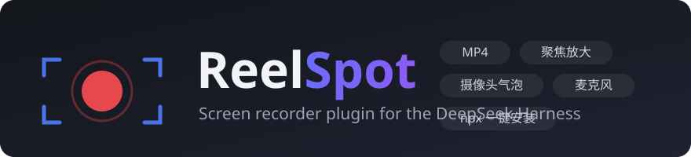

# ReelSpot



零依赖的浏览器录屏库 + DSH 对话界面插件。一键录制屏幕 / 窗口 / 标签页，输出 **MP4**（不支持时自动回退 WebM，可一键转 MP4），支持**麦克风混音**、**光标跟随放大聚焦**、**光标高亮/点击波纹**、**摄像头气泡**、**倒计时**和**暂停/继续**。

A zero-dependency browser screen recorder — one-click screen / window / tab capture with **MP4** output (WebM fallback), **microphone mixing**, and **cursor-follow zoom**. Ships as a plain JS library plus a plugin for the [DeepSeek Harness (DSH)](https://www.npmjs.com/package/@deepseek-ai/dsh) Web GUI.

> Inspired by [Recordly](https://github.com/webadderallorg/Recordly) (AGPL-3.0 desktop app). ReelSpot is written from scratch in the browser — no Recordly code is used — and is MIT licensed.

---

## 特性 / Features

- 🎥 **屏幕 / 窗口 / 标签页录制** — 基于 `getDisplayMedia` + `MediaRecorder`
- 📼 **MP4 优先** — H.264 + AAC（Chrome/Edge 126+），自动回退 WebM；回退时可一键 **ffmpeg 转 MP4**（Host 端）
- 🎤 **麦克风混音** — `AudioContext` 将标签页/系统音频与麦克风混成一条音轨
- 🔍 **放大聚焦** — canvas 实时管线：光标移动时平滑放大跟随（默认 1.8×），静止后缩回全景；录制中 **Alt+滚轮** 实时调倍数（1× = 整页全景，最高 3.5×），放大时右上角显示**取景小地图**（整页缩略 + 黄框标记当前取景范围 + 倍数角标）
- 🖥️ **操作者监视窗** — 录制**本标签页**时，工具栏出现 🖥️ 按钮，点开一个 Document PiP 悬浮小窗实时显示正在录制的合成画面（canvas 帧块传输，独立顶层窗口不会被录进视频），取景调整所见即所得；录整个屏幕/窗口时提示不可用（避免镜像递归）
- 🖱️ **光标高亮 + 点击波纹** — 演示视频更清晰（仅录本标签页时跟踪光标）
- 📹 **摄像头气泡** — Recordly 风格圆形 webcam 画中画（位置/大小可配）
- ⏱️ **倒计时 + 暂停/继续** — 3-2-1 开录，录制中可暂停（时长统计扣除暂停段）
- ⌨️ **快捷键** — `Alt+Shift+R` 开始/停止
- 🧩 **两种形态** — 独立 JS 库（任何网页可用）+ DSH 插件（对话框右上角按钮；npx 持久安装或一句话动态试用）

## 浏览器限制 / Browser limitations

| 场景 | 说明 |
| --- | --- |
| 系统声音 | Windows 上 Chrome 仅**标签页**捕获可带音频（勾选"分享标签页音频"）；录整个屏幕无系统声音 → 用麦克风补充 |
| 聚焦光标跟踪 | 仅录制**本页面标签页**时网页才能拿到光标位置；录其他窗口时保持全景 |
| MP4 录制 | 需要 Chrome/Edge 126+；更老的浏览器自动输出 WebM |

## 用法一：独立库 / As a library

```html
<script src="src/reelspot.js"></script>
<script>
  const recorder = ReelSpot.createRecorder({ mic: true, zoom: true })
  recorder.on('stop', ({ blob, name }) => {
    const a = document.createElement('a')
    a.href = URL.createObjectURL(blob)
    a.download = name // reelspot-YYYYMMDD-HHmmss.mp4
    a.click()
  })
  await recorder.start() // 弹出屏幕选择器；用户取消时返回 null
  // recorder.stop()     // 结束并触发 'stop' 事件
</script>
```

完整可运行示例见 `examples/standalone.html`（需通过 http(s) 或 localhost 打开，`getDisplayMedia` 要求安全上下文）。

### API

```js
const recorder = ReelSpot.createRecorder(options?)
```

| 选项 | 默认 | 说明 |
| --- | --- | --- |
| `mic` | `true` | 请求麦克风并混入 |
| `webcam` | `false` | 摄像头气泡（圆形画中画） |
| `webcamSize` | `0.18` | 气泡直径占画面宽度比例 |
| `webcamPosition` | `'bottom-right'` | `bottom-right` / `bottom-left` / `top-right` / `top-left` |
| `webcamMirror` | `true` | 摄像头镜像（自拍惯例） |
| `zoom` | `false` | 启用光标跟随放大聚焦 |
| `zoomFactor` | `1.8` | 放大倍数（初始值，录制中可用 Alt+滚轮实时调整） |
| `zoomIdleMs` | `2000` | 光标静止多久后缩回全景 |
| `zoomWheel` | `true` | Alt+滚轮实时调节放大倍数（1× = 整页全景） |
| `zoomMax` | `3.5` | 滚轮可调的倍数上限 |
| `zoomStep` | `0.2` | 滚轮每格步进 |
| `zoomMinimap` | `true` | 放大时显示取景小地图（缩略图 + 视口框 + 倍数角标） |
| `operatorPreview` | `true` | 允许把合成画面接入监视窗 |
| `previewWindow` | `null` | 可选：调用方传入的 Document PiP 窗口（也可录制中调用 `recorder.attachPreviewWindow(win)`，注意 `requestWindow()` 会消耗用户激活，不能在 `getDisplayMedia` 之前调用） |
| `cursorFx` | `false` | 光标高亮圈 + 点击波纹 |
| `countdown` | `3` | 开录前倒计时秒数（0 = 关闭） |
| `frameRate` | `30` | 帧率 |
| `maxWidth` | `1920` | 合成管线画布宽度上限 |
| `videoBitsPerSecond` | `6000000` | 视频码率 |
| `audioBitsPerSecond` | `192000` | 音频码率 |
| `filePrefix` | `'reelspot'` | 生成文件名的前缀 |

| 方法 / 事件 | 说明 |
| --- | --- |
| `start()` | 开始录制；resolve 为 `{ audioMode, zoomed, webcam, ext, mime }`，用户取消选择器或倒计时 resolve `null` |
| `stop()` | 停止；完成后触发 `'stop'`（倒计时中调用 = 取消） |
| `pause()` / `resume()` | 暂停 / 继续录制 |
| `getState()` | `'idle'` \| `'countdown'` \| `'recording'` \| `'paused'` |
| `on('stop', fn)` | `fn({ blob, size, name, ext, mime, audioMode, zoomed, webcam, startedAt, durationMs })` |
| `on('state', fn)` | `fn('idle' \| 'countdown' \| 'recording' \| 'paused')` |
| `on('countdown', fn)` | `fn(剩余秒数)` — 3, 2, 1 |
| `on('error', fn)` | 非致命错误（如麦克风被拒） |
| `ReelSpot.isSupported()` | 当前浏览器是否支持录屏 |
| `ReelSpot.pickFormat()` | 实际会使用的 `{ mime, ext }` |

`audioMode`：`'system+mic'` \| `'system'` \| `'mic'` \| `'none'`。

## 用法二：DSH 插件 / As a DSH plugin

### npx 持久安装（推荐，永久生效）

```bash
npx dsh-reelspot install
# 然后重启 DSH（停掉当前 dsh web 再启动），硬刷新页面
```

这是 DSH 官方的**组合插件**机制：安装器把包放进 profile 的 `node_modules` 并向 `cordis.patch.yml` 插入一行 loader 配置。装好后**永久生效、无需批准**。卸载：`npx dsh-reelspot uninstall`。

> 未发布 npm 前可本地执行：`node reelspot/dsh/bin/install.mjs install`

### 一句话试用（动态插件，进程级）

在 DSH 对话框里发送这句话即可，无需 clone、无需构建：

```
安装 ReelSpot 录屏插件：读取 https://raw.githubusercontent.com/zrt-ai-lab/open-dsh-plugins/main/reelspot/dist/reelspot-dsh.client.js 和 https://raw.githubusercontent.com/zrt-ai-lab/open-dsh-plugins/main/reelspot/dist/reelspot-dsh.host.js ，分别作为 code.client 和 code.host 调用 cordis_define（idPrefix 用 reelsp），然后 cordis_run 运行
```

在弹出的批准卡片上点 ✓（点 ✓✓ 授权未来版本，以后更新免确认）。DSH 重启后动态插件消失，重发这句话即可重装；想永久生效请用上面的 npx 持久安装。

### 手动安装

**安装不需要构建**——`dist/` 目录已包含构建产物，直接用即可：

```bash
git clone https://github.com/zrt-ai-lab/open-dsh-plugins.git
cd open-dsh-plugins/reelspot
# dist/reelspot-dsh.client.js -> cordis_define 的 code.client
# dist/reelspot-dsh.host.js   -> cordis_define 的 code.host
```

在 DSH 会话中让 Cordis 代理读取这两个文件并完成 `cordis_define` + `cordis_run`，或自行调用。

> 只有**修改了 `src/` 源码**才需要重新构建（注意先 `cd` 到本目录再执行）：
>
> ```bash
> cd open-dsh-plugins/reelspot   # 必须在 reelspot 目录内，否则会报 Cannot find module
> node build.mjs                 # 重新生成 dist/
> ```

安装后对话框（会话头部）右上角出现 **🖱️ 🔍 📹 🎤 ● 录屏** 按钮组（光标特效 / 聚焦 / 摄像头 / 麦克风开关 + 录制），快捷键 `Alt+Shift+R` 开始/停止；录制中可 ⏸ 暂停。停止后弹出预览面板：播放、下载、保存到工作区 `recordings/`；WebM 录像（老浏览器）另有「转 MP4」按钮（需主机安装 ffmpeg，或设 `REELSPOT_FFMPEG` 环境变量）。

## 开发 / Development

```
src/reelspot.js                 核心库（零依赖，纯浏览器 API）
src/dsh-plugin/client.js        动态插件客户端壳（UI，cordis_define 形态）
src/dsh-plugin/host.js          动态插件 Host 端（保存到工作区）
src/dsh-plugin/client.bundle.js 组合插件客户端（dsh.client 模块表形态）
dsh/                            可发布的组合插件包（npx dsh-reelspot install）
  lib/index.js                  Host 端：POST /dsh-reelspot/save 保存路由
  lib/client.js                 构建生成的浏览器 bundle
  bin/install.mjs               安装/卸载器（profile node_modules + cordis.patch.yml）
examples/standalone.html        独立演示页
build.mjs                       生成 dist/ 与 dsh/lib/client.js
```

## License

[MIT](LICENSE) © 2026 ReelSpot contributors
